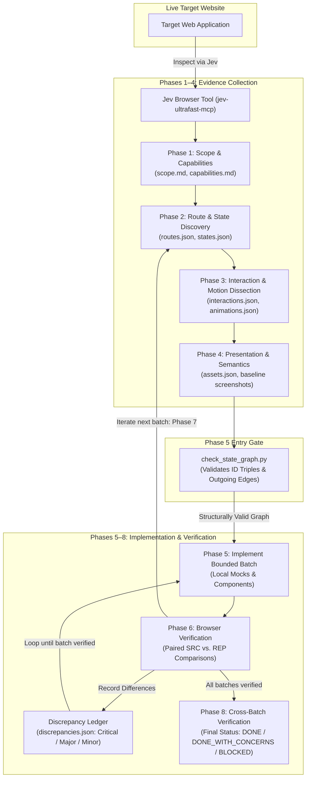

<p align="center">
  
</p>

<h1 align="center">Swiper</h1>

<p align="center">
  <strong>Evidence-driven agent skill for reverse engineering and recreating website frontends using browser inspection.</strong>
</p>

<p align="center">
  
  
  
  
  
</p>

---

## Overview

**Swiper** is an agent skill for autonomously inspecting live websites and building high-fidelity local frontend replicas. Instead of relying on guesswork, shallow source downloads, or loose screenshot prompts, Swiper enforces an **evidence-driven contract**:

1. **Repository & Browser Truth > Inference**: Every route, layout variation, interaction, transition, asset, and animation must be observed and registered before implementation.
2. **Deterministic Local Mocks**: Replicas decouple completely from the target's backend, reproducing state changes, loading indicators, validation errors, and persistence through local mock fixtures.
3. **No Unverified Batch Stacking**: Frontend code is implemented in bounded slices. If browser inspection or verification is blocked, the agent must halt further implementation batches and report the blocker rather than piling unverified code on top of guesses.
4. **Graph Integrity Gating**: State transitions are modeled as a directed graph with strict source/destination triple invariants, validated prior to coding by an included Python checker.

---

## Tech Stack

| Layer / Role | Tooling & Technology | Purpose in Swiper |
| --- | --- | --- |
| **Skill Workflow** | Markdown & YAML frontmatter | Entry point in [`skills/swiper/SKILL.md`](./skills/swiper/SKILL.md) defining the 8-phase workflow and exit conditions |
| **Browser Inspection** | Jev Ultrafast (`jev-ultrafast-mcp`) | Discovers DOM, computed styles, responsive viewports, interactions, and captures screenshots |
| **Graph Validation** | Python 3 (Standard Library) | Validates route/state/interaction triple integrity via [`skills/swiper/scripts/check_state_graph.py`](./skills/swiper/scripts/check_state_graph.py) |
| **Verification & Testing** | Python `unittest` | Automated regression test suite in [`skills/swiper/tests/test_check_state_graph.py`](./skills/swiper/tests/test_check_state_graph.py) |
| **Evidence Contract** | JSON Schema (v1) & Markdown | Structured monotonic records stored in `.replica-evidence/` using templates in [`skills/swiper/assets/evidence-template/`](./skills/swiper/assets/evidence-template/) |
| **Benchmark Evals** | Markdown Tabletop Evaluations | Scenarios and small-model evaluation runs documented in [`skills/swiper/evals/`](./skills/swiper/evals/) |

---

## Workflow & Architecture

Swiper executes an 8-phase sequential pipeline. Each phase consumes evidence from previous steps, updates `.replica-evidence/`, and enforces explicit exit gates before proceeding:



### The 8 Phases

1. **Establish Scope & Capabilities**: Discover current browser tool schemas (`capabilities.md`), confirm URL boundaries, required desktop/mobile viewports, and exclusions (`scope.md`).
2. **Discover Routes & States**: Explore reachable same-site navigation. Distinguish meaningful states (out-of-stock, loading, error, empty, modals) from plain data variations.
3. **Dissect Interactions & Motion**: Record triggers, transitions, timing (`durationMs`, `delayMs`, `easing`), and intermediate keyframes. Never guess animation curves.
4. **Inspect Presentation & Semantics**: Document layout geometry, computed typography, colors, asset URLs, accessibility names, tab order, and focus trapping.
5. **Implement One Bounded Batch**: Build only the evidenced batch into the destination project using deterministic local mocks. Never call target backend APIs.
6. **Browser Verify That Batch**: Run the replica locally, capture paired source (`SRC`) and replica (`REP`) screenshots under matching viewports and phases, and log discrepancies.
7. **Repeat (Phases 2–6)**: Proceed to the next bounded slice only after the current batch passes verification.
8. **Cross-Batch Verification**: Replay connected flows, verify persistent state across routes, and finalize reporting.

---

## The Evidence Contract (`.replica-evidence/`)

On its first invocation, Swiper initializes `.replica-evidence/` from [`skills/swiper/assets/evidence-template/`](./skills/swiper/assets/evidence-template/):

```text
.replica-evidence/
├── scope.md                   # Target URL, viewports, boundaries, and accepted exclusions
├── capabilities.md            # Live inspection tools discovered and supported operations
├── session.md                 # Current phase, batch cursor, and known blockers
├── routes.json                # Discovered URL patterns and canonical route families (R001...)
├── states.json                # Observable UI conditions, transitions, and assertions (S001...)
├── interactions.json          # Actions linking source and destination states (I001...)
├── animations.json            # Measured motion properties, durations, and easings (A001...)
├── assets.json                # Scraped images, fonts, and local mapping paths (AS001...)
├── discrepancies.json         # Differences categorized by severity and disposition (D001...)
├── implementation-map.json    # Mapping of components and files to verified batches (B001...)
├── screenshots/
│   ├── source/                # Immutable source captures: SRC-R001-S001-V-DESKTOP-before-01.png
│   └── replica/               # Paired replica captures: REP-R001-S001-V-DESKTOP-before-01.png
```

### Key Contract Rules

- **Globally Unique Monotonic IDs**: `R001` (routes), `S001` (states), `I001` (interactions), `A001` (animations), `AS001` (assets), `D001` (discrepancies), `B001` (batches). IDs are never reused.
- **Strict Transition Triples**: Every transition from `S001` using `I001` to `S002` must strictly match `I001.sourceStateId == S001` and `I001.destinationStateId == S002`. Shared action names between different states require distinct interaction IDs.
- **Explicit Unknowns**: If timing or styles cannot be measured, fields use `null` with a required `nullReasons` dictionary explaining why. Values are never fabricated.

---

## Repository Structure

```text
.
├── Swiper.png                             # Swiper mascot mark
├── README.md                              # Repository overview and technical documentation
└── skills/
    └── swiper/
        ├── SKILL.md                       # Core skill definition and 8-phase instructions
        ├── assets/
        │   └── evidence-template/         # Baseline JSON and Markdown templates for .replica-evidence/
        │       ├── animations.json
        │       ├── assets.json
        │       ├── capabilities.md
        │       ├── discrepancies.json
        │       ├── implementation-map.json
        │       ├── interactions.json
        │       ├── routes.json
        │       ├── scope.md
        │       ├── session.md
        │       └── states.json
        ├── references/                    # Deep technical specifications for each phase
        │   ├── animation-inspection.md    # Timing, keyframe, and motion measurement procedures
        │   ├── browser-inspection.md      # Jev capability discovery, DOM/CSS inspection, and fallbacks
        │   ├── discovery-and-state.md     # Route queue handling and state graph modeling
        │   ├── evidence-contract.md       # JSON schemas, record fields, and capture naming standards
        │   ├── implementation.md          # Bounded batching, local mock design, and component mapping
        │   └── verification.md            # Paired visual comparison, tolerance, and completion gates
        ├── scripts/
        │   └── check_state_graph.py       # Read-only Python checker for state graph integrity
        ├── tests/
        │   └── test_check_state_graph.py  # Unit test suite for the graph validator
        └── evals/                         # Empirical validation and benchmark results
            ├── scenarios.md               # Tabletop scenarios and artifact construction test cases
            └── results.md                 # Baseline vs. green agent benchmark outcomes
```

---

## Installation & Setup

### Prerequisites

- **Python 3.9+** (Standard library only; zero external Python dependencies required for the state graph checker and test suite).
- **Jev Ultrafast MCP** (`jev-ultrafast-mcp`) configured in your agent environment for autonomous browser inspection and screenshot capture.
- **Git** (for cloning the repository).

---

### Step 1: Clone the Repository

Clone the Swiper repository to your local environment:

```bash
git clone https://github.com/normieg/Swiper.git
cd Swiper
```

---

### Step 2: Install as an Agent Skill

Swiper follows the standard skill package structure (`SKILL.md` + `references/` + `assets/` + `scripts/`). You can install it globally for your AI coding assistant or locally within a specific project workspace:

#### Option A: Global Skill Installation

Depending on your agent runtime, copy or link `skills/swiper` into your global skills directory:

**For Codex CLI:**
```bash
mkdir -p ~/.codex/skills
cp -r skills/swiper ~/.codex/skills/swiper
```

**For Antigravity CLI / Agent Runtimes:**
```bash
mkdir -p ~/.agents/skills
cp -r skills/swiper ~/.agents/skills/swiper
```

**For Claude Code / Claude Desktop:**
```bash
mkdir -p ~/.claude/skills
cp -r skills/swiper ~/.claude/skills/swiper
```

> [!TIP]
> **Active Development Symlink**: If you want edits in this repo to be immediately reflected in your agent sessions without copying every time, create a symbolic link instead:
> ```bash
> ln -s "$(pwd)/skills/swiper" ~/.codex/skills/swiper
> # or:
> ln -s "$(pwd)/skills/swiper" ~/.agents/skills/swiper
> ```

#### Option B: Workspace-Level Installation

To equip Swiper for a specific project without installing it globally, copy `skills/swiper` directly into your target workspace:

```bash
# From within your project's root:
mkdir -p .agents/skills
cp -r /path/to/Swiper/skills/swiper .agents/skills/swiper
```

---

### Step 3: Configure Browser MCP Tooling (Jev Ultrafast)

Swiper uses the `jev-ultrafast-mcp` browser server for live DOM/CSS inspection, viewport verification, and paired screenshot capture.

Ensure `jev-ultrafast-mcp` is configured in your agent's MCP settings (e.g. `~/.gemini/antigravity-cli/mcp/`, `claude_desktop_config.json`, or your IDE's MCP config):

```json
{
  "mcpServers": {
    "jev-ultrafast-mcp": {
      "command": "npx",
      "args": ["-y", "jev-ultrafast-mcp"]
    }
  }
}
```

---

### Step 4: Verify the Installation

Run the bundled test suite to ensure the environment and graph checker are working properly:

```bash
# 1. Run unit tests (6 tests, ~10ms)
python3 -m unittest discover -s skills/swiper/tests -v

# 2. Test the state graph checker on the bundled evidence template
python3 skills/swiper/scripts/check_state_graph.py skills/swiper/assets/evidence-template
```

Expected output:
```text
test_actual_reused_interaction_failures (test_check_state_graph.StateGraphTests) ... ok
test_consistent_graph (test_check_state_graph.StateGraphTests) ... ok
...
Ran 6 tests in 0.010s

OK
Structurally valid: 0 states, 0 interactions. Structural consistency only; not coverage, browser verification, or fidelity.
```

---

### Step 5: How to Invoke Swiper

Once installed, invoke Swiper in your AI coding agent session using any of the following methods:

**1. Skill Prefix / Command:**
```text
$swiper Recreate https://example.com with responsive navigation and local mock data
```

**2. Slash Command:**
```text
/swiper https://example.com
```

**3. Natural Language Prompts:**
- *"Clone the landing page at https://example.com and build a local React replica using Swiper."*
- *"Dissect and reverse engineer the checkout flow and animations of https://example.com with local mocks."*
- *"Replicate the navigation and modal states of https://example.com."*

---

## Validation & Testing

### Running the State Graph Checker

Before implementing any batch, validate the consistency of `.replica-evidence/` using the bundled checker:

```bash
python3 skills/swiper/scripts/check_state_graph.py <destination>/.replica-evidence
```

To verify the template itself:

```bash
python3 skills/swiper/scripts/check_state_graph.py skills/swiper/assets/evidence-template
# Output:
# Structurally valid: 0 states, 0 interactions. Structural consistency only; not coverage, browser verification, or fidelity.
```

The checker validates:
- Schema versions and required top-level JSON collections.
- Monotonic typed IDs (`R...`, `S...`, `I...`) and duplicate detection.
- Foreign key resolution across routes, states, and interactions.
- Source/destination state triple matching on every outgoing edge.
- Presence of explicit `nullReasons` for any unmeasured fields.

### Running the Python Unit Tests

Run the test suite using Python's built-in `unittest` runner:

```bash
python3 -m unittest discover -s skills/swiper/tests -v
```

Expected output:

```text
test_actual_reused_interaction_failures (test_check_state_graph.StateGraphTests) ... ok
test_consistent_graph (test_check_state_graph.StateGraphTests) ... ok
test_duplicate_and_unresolved_ids (test_check_state_graph.StateGraphTests) ... ok
test_empty_templates_are_structural_only (test_check_state_graph.StateGraphTests) ... ok
test_malformed_json (test_check_state_graph.StateGraphTests) ... ok
test_null_requires_reason_and_warns (test_check_state_graph.StateGraphTests) ... ok

----------------------------------------------------------------------
Ran 6 tests in 0.010s

OK
```

---

## Evaluations & Benchmarks

The [`skills/swiper/evals/`](./skills/swiper/evals/) suite evaluates agent decision-making under realistic constraints (such as deadline pressure and disabled JS evaluation):

- **Baseline vs. Green Runs**: In benchmark evaluations (`gpt-6-luna`), baseline models failed by continuing to write unverified code when browser verification was unavailable. When running with Swiper, the agent correctly halted implementation, preserved distinct variant states (e.g. out-of-stock items), and honestly reported `BLOCKED` until verification could resume.
- **Artifact Construction**: Verified that the state graph checker successfully prevents invalid transition edges and maintains graph invariants across iterations.

---

## Operational Policies & Honesty Gates

Swiper strictly adheres to transparent status reporting upon completing or pausing work:

| Status | Condition |
| --- | --- |
| `DONE` | All in-scope routes, states, motion, and viewports have been observed, implemented, verified in-browser, and have zero open discrepancies. |
| `DONE_WITH_CONCERNS` | All required implementation batches are verified, with documented and accepted minor discrepancies (or explicit user-approved scope exclusions). |
| `BLOCKED` | Required browser tools are unavailable, live inspection is blocked, or critical discrepancies remain unresolved. Implementation batches are stopped immediately. |

> [!IMPORTANT]
> **No Unverified Batch Stacking**: Swiper never implements multiple frontend batches while deferring browser verification to the end. Verification occurs after every single bounded batch.
